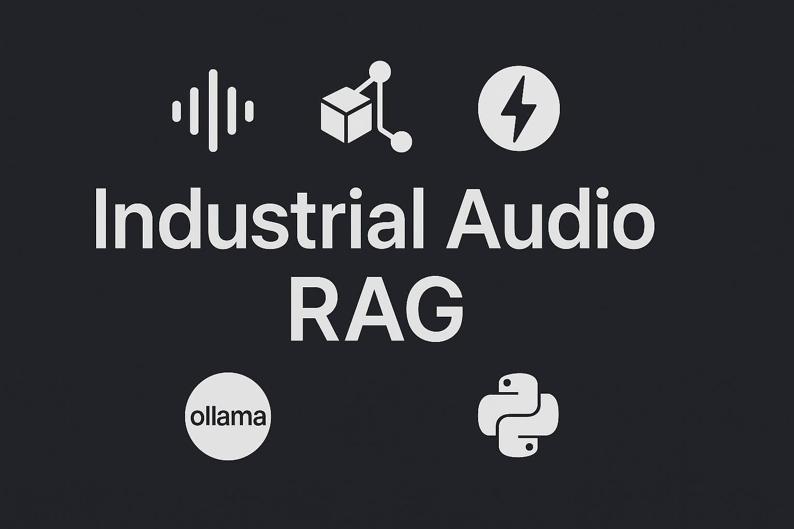
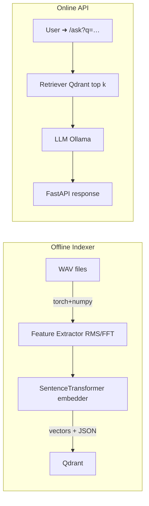

# RAG Assistant for Industrial Audio

> **Project tagline:** *Ask natural‑language questions about factory machine sounds.*

This walkthrough shows how to turn 2 GB of **DCASE 2024 Task‑2** audio logs into an interactive Retrieval‑Augmented‑Generation (RAG) service powered by an open‑source LLM and **Qdrant** vector search.
Along the way we will some advanced signal processing, fast batch embedding techniques, and wrap the whole thing into a production‑grade FastAPI backend, together with snapshot‑based MLOps.

---

##  What is this about
When you are faced with a large dataset made of texts, LLMs and RAG techniques represent a clear choice of techniques. After all, LLMs are all about predicting what word comes next, after a given context.
Industrial datasets are a whole different beast. They are rarely based on texts. For example, you might be faced with a bunch of sensor recordings. They could be wav files (coming from arrays of microphones) or accelerometer data. These continuous signals are actually not so far from texts: after all, once they enter the computer, the signals are discretized (think: streams of 0 and 1), so you could imagine that LLM might enter the scene and reason about these "texts" made of 0 and 1. In other words, you would work with LLMs directly on the raw signals. But you could do something different. By performing **numeric feature extraction** (RMS, FFT peaks), you could produce more meaningful streams of signals, and by combining them with a language model, you could directly query those raw sensor streams in plain English:

> *“Which anomalous bearing clips in section 00 had a dominant frequency above 900 Hz?”*


---

## Architecture 



* **Indexer script:** `dcase_indexer.py` (runs once; \~3 min on M1).
* **API service:** `rag_api.py` (<40 LOC).
* **Snapshots:** one command restores the full collection in seconds.

---

## Quick‑start

```bash
# 1. Clone repo & install env
conda env create -f env.yml
conda activate ml_py310

# 2. Download dataset (≈2.2 GB) → Data/Dcase
bash scripts/get_dcase24.sh

# 3. Index vectors (one‑off)
python dcase_indexer.py --data Data/Dcase

# 4. Run Qdrant + API
docker compose up -d qdrant
uvicorn rag_api:app --reload
```

Open [http://localhost:8000/docs](http://localhost:8000/docs) to try the `/ask` endpoint.

---

## Example queries you can try

| Query                                                                          | Sample answer                                                               |
| ------------------------------------------------------------------------------ | --------------------------------------------------------------------------- |
| *Which bearing clips in section 00 target domain show dominant freq > 900 Hz?* | Lists 4 file paths with 1 .02 kHz peak, highlights possible looseness fault |
| *Summarise differences between normal and anomalous valves in section 03.*     | Mentions +12 dB RMS rise, dominant burst at 680 Hz, links 3 examples        |
| *Why is gearbox section 01 SNR lower than its source domain?*                  | Explains added background fan noise and references 2 clipped recordings     |

---

## Core code snippets

```python
# feature extraction (simplified)
def compute_features(signal, sr):
    rms = float(torch.sqrt(torch.mean(signal**2)))
    fft = torch.fft.rfft(signal)
    freqs = torch.fft.rfftfreq(signal.shape[-1], d=1/sr)
    dom  = float(freqs[fft.abs().argmax()])
    return {"rms": rms, "dominant_freq_hz": dom}
```

```python
# FastAPI route
@app.get("/ask")
async def ask(q: str):
    vec = embedder.encode(q)
    hits = client.search(collection_name=COLL, query_vector=vec, limit=6)
    context = "\n".join(json.dumps(h.payload) for h in hits)
    prompt = f"CONTEXT:\n{context}\nQUESTION: {q}"
    return {"answer": ollama.chat(model="mistral", messages=[{"role":"user","content":prompt}])["message"]["content"]}
```

---

# industrial-audio-rag extra instructions

## First run?

| # | Command (from repo root)                                                                                                                       | What it does                                                        |
| - | ---------------------------------------------------------------------------------------------------------------------------------------------- | ------------------------------------------------------------------- |
| 1 | `conda env create -f env.yml && conda activate ml_py310`                                                                                       | Creates + activates the Python 3.10 env                             |
| 2 | `bash scripts/get_dcase24.sh`                                                                                                                  | Downloads & unzips the DCASE-24 dev set (≈ 2 GB) into `Data/Dcase/` |
| 3 | `docker run -d --name qdrant -p 6333:6333 qdrant/qdrant:v1.8.1`                                                                                | Starts Qdrant vector DB                                             |
| 4 | `python -m rag_audio.indexer --data Data/Dcase`                                                                                                | Extracts features → embeds → upserts (≈ 3 min CPU)                  |
| 5 | `uvicorn rag_audio.api:app --reload`                                                                                                           | Launches FastAPI on [http://localhost:8000](http://localhost:8000)  |
| 6 | `curl "http://localhost:8000/ask?q=Which%20anomalous%20bearing%20clips%20in%20section%2000%20have%20dominant%20frequency%20above%20900%20Hz?"` | Test query → JSON answer                                            |


## Second run
Replace steps 2-4 by:

```bash
docker run -d --name qdrant -p 6333:6333 qdrant/qdrant:v1.8.1
docker cp /path/to/dcase24_bearing.snapshot \
          qdrant:/qdrant/snapshots/dcase24_bearing/
```

then run this python script:

```python
from qdrant_client import QdrantClient
client = QdrantClient(url="http://localhost:6333")
client.restore_snapshot(
    collection_name="dcase24_bearing",
    snapshot_path="/qdrant/snapshots/dcase24_bearing/dcase24_bearing.snapshot",
    wait=True,
)
```

And finally:

```bash
uvicorn rag_audio.api:app --reload      # serve
curl "http://localhost:8000/ask?q=..."  # query
```
